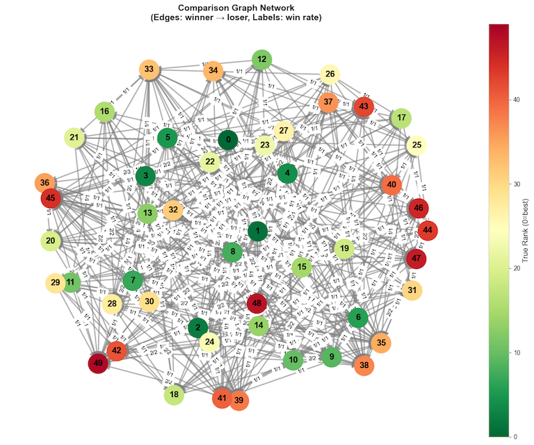
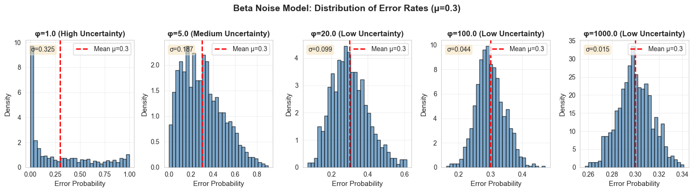
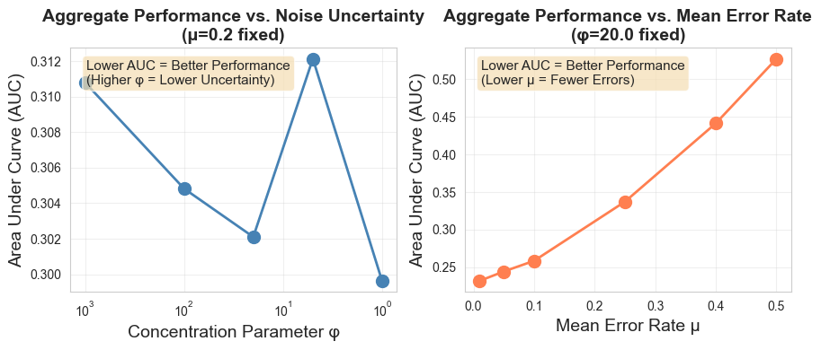
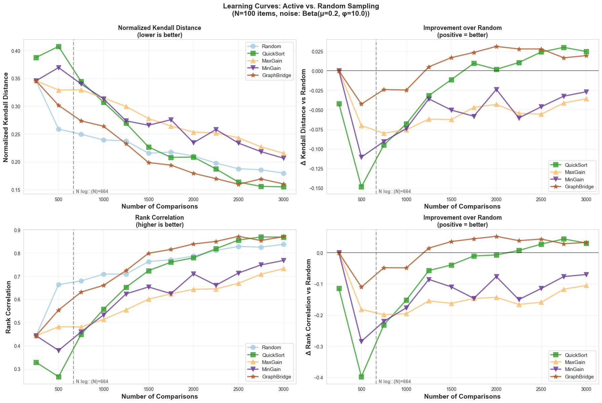
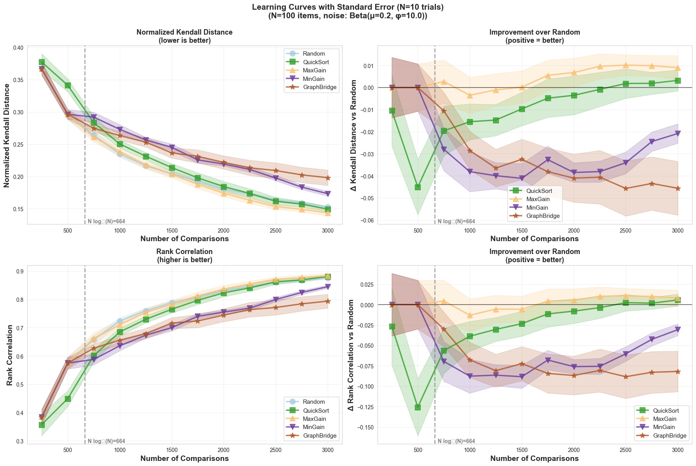
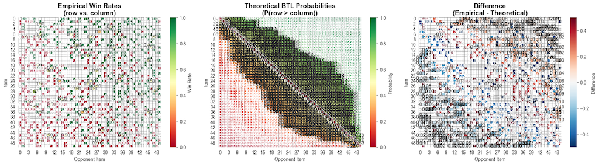

# ltr-with-noisy-labels

A Python package for simulating learning-to-rank algorithms under Beta-distributed comparison noise.




## Overview

`ltr_wnl` studies how noise uncertainty affects sample complexity in pairwise comparison-based ranking. Key question: **How does variance in error rates impact the number of comparisons needed for accurate ranking?**


*Beta-distributed error rates with different concentration parameters (φ). Low φ = high uncertainty.*




## Features

- **Beta-distributed noise**: Configurable mean (μ) and concentration (φ) for heterogeneous error rates
- **BTL model**: Generate ground truth item strengths and probabilistic comparisons
- **Ranking algorithms**: Borda Count, Plackett-Luce, Rank Centrality (via `choix`)
- **Active learning sampling**: Multiple strategies including uncertainty-based, quicksort-adaptive, and graph-based sampling
- **Evaluation metrics**: Kendall's tau, top-k accuracy, rank correlation
- **Simulation engine**: Reproducible experiments with parameter sweeps and learning curve tracking
- **Extensible**: Abstract base classes for custom noise models, rankers, and sampling strategies

## Quick Start

```python
from ltr_wnl import noise, ranking, sampling, simulation

# Setup simulation
runner = simulation.SimulationRunner(
    n_items=100,
    noise_model=noise.BetaNoiseModel(mu=0.3, phi=2.0),
    ranker=ranking.choix_rankers.PlackettLuceRanker(),
    sampling_strategy=sampling.RandomSampler()
)

# Run trial
results = runner.run_trial(n_comparisons=500, random_state=42)
print(f"Kendall distance: {results['kendall_distance']}")
```

## Active Learning Sampling Strategies

Instead of random pair selection, use adaptive strategies to reduce sample complexity:

```python
from ltr_wnl import sampling, ranking

# Uncertainty-based active learning (MaxGain)
# Selects pairs with highest entropy (P(i > j) ≈ 0.5)
max_gain = sampling.MaxGainSampler(
    ranker=ranking.PlackettLuceRanker(),
    batch_size=250,
    burn_in_count=500
)

# QuickSort-based adaptive sampling
# Uses quicksort partitioning (Multisort algorithm)
quicksort = sampling.QuickSortSampler(random_state=42)

# Graph connectivity-based sampling
# Targets high betweenness centrality nodes
graph_bridge = sampling.GraphBridgeSampler(burn_in_count=500)
```

### Comparison of Sampling Strategies


*With 250-comparison burn-in: QuickSort performs best initially*


*With 500-comparison burn-in: MaxGain (uncertainty-based) achieves best performance*

**Key Findings** (N=100 items, μ=0.20 noise, 10 trials):

- **MaxGain**: 5.9% better than Random (requires adequate burn-in)
- **QuickSort**: 2% better than Random (works well from the start)
- **MinGain** (anti-active control): 13.6% worse than Random (validates uncertainty sampling)
- **GraphBridge**: No significant improvement

**Burn-in is Critical**: The uncertainty-based sampler (MaxGain) requires sufficient random comparisons (500+) to build a reliable model before active selection begins. Without adequate burn-in, QuickSort's adaptive partitioning strategy performs better as it doesn't rely on pre-trained model estimates.

### Visualizations

**Comparison Graph Network**: Visualize pairwise comparisons as a directed graph where edges point from winner to loser.


**Win Rate Analysis**: Compare empirical win rates against theoretical BTL probabilities to validate the noise model.



## Installation

```bash
git clone https://github.com/gmgeorg/ltr-with-noisy-labels.git
cd ltr-with-noisy-labels
poetry install
```

Or with pip:

```bash
pip install -e .
```

**Dependencies**: numpy, scipy, choix, networkx, seaborn

## Citation

If you use this package in your research, please cite:

```bibtex
@software{ltr_wnl,
  title={ltr-with-noisy-labels: Learning to Rank with Noisy Labels},
  author={Georg M. Goerg},
  year={2025},
  url={https://github.com/gmgeorg/ltr-with-noisy-labels}
}
```

## References

- Bradley & Terry (1952): Rank analysis of incomplete block designs
- Luce (1959): Individual choice behavior
- Maystre & Grossglauser (2015): Fast and accurate inference of Plackett-Luce models
- Maystre & Grossglauser (2017): [Just Sort It! A Simple and Effective Approach to Active Preference Learning](https://dl.acm.org/doi/10.5555/3305890.3305923) (ICML 2017)
- [`choix` library](https://github.com/lucasmaystre/choix)

## License

MIT License
